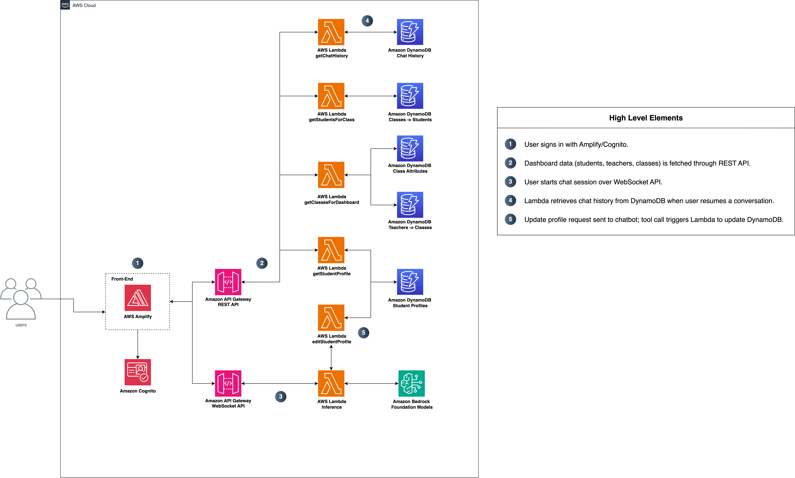

# k12-co-teacher
In K-12 classrooms, teachers are responsible for meeting the diverse needs of all learners ranging from students receiving special education services and those with 504 accommodations, to English language learners and gifted and talented students who require enrichment. Each of these groups comes with distinct supports and instructional considerations that must be applied consistently for students to succeed.  This solution provides an AI-powered classroom assistant tha helps teachers quickly generate differentiated lesson plans and respond to student needs.  Using Individual Education Plans (IEPs), 504 plans, and evaluation reports the solution extracts and highlights concise modifications to an existing lesson plan for the teacher.  AWS Lambda and Amazon API Gateway provide backend application logic, while Amazon DynamoDB stores student profiles, class rosters, teacher notes, and chat history. Authentication and access are managed with Amazon Cognito, and the application is deployed with AWS Amplify. 


### Table of contents

- [Licence](#licence)
- [Key Features](#key-features)
- [Architecture overview](#architecture-overview)
  - [Architecture reference diagram](#architecture-reference-diagram)
  - [Solution components](#solution-components)
- [Prerequisites](#prerequisites)
  - [Build environment specifications](#build-environment-specifications)
  - [AWS account](#aws-account)
  - [Tools](#tools)
- [How to build and deploy the solution](#how-to-build-and-deploy-the-solution)
  - [Configuration](#configuration)
  - [Build and deploy](#build-and-deploy)
---

## Collaboration

Thanks for your interest in our solution. Having specific examples of replication and cloning allows us to continue to grow and scale our work. If you clone or download this repository, kindly shoot us a quick email to let us know you are interested in this work!

[wwps-cic@amazon.com]

---

# Disclaimers

**Customers are responsible for making their own independent assessment of the information in this document.**

**This document:**

(a) is for informational purposes only,

(b) represents current AWS product offerings and practices, which are subject to change without notice, and

(c) does not create any commitments or assurances from AWS and its affiliates, suppliers or licensors. AWS products or services are provided “as is” without warranties, representations, or conditions of any kind, whether express or implied. The responsibilities and liabilities of AWS to its customers are controlled by AWS agreements, and this document is not part of, nor does it modify, any agreement between AWS and its customers.

(d) is not to be considered a recommendation or viewpoint of AWS

**Additionally, all prototype code and associated assets should be considered:**

(a) as-is and without warranties

(b) not suitable for production environments

(d) to include shortcuts in order to support rapid prototyping such as, but not limitted to, relaxed authentication and authorization and a lack of strict adherence to security best practices

**All work produced is open source. More information can be found in the GitHub repo.**

## Authors

- Noor Dhaliwal - rdhali07@calpoly.edu
- Sharon Liang - sliang19@calpoly.edu


## Licence

Licensed under the Apache License Version 2.0 (the "License"). You may not use this file except in compliance with the License. A copy of the License is located at

    http://www.apache.org/licenses/

or in the "license" file accompanying this file. This file is distributed on an "AS IS" BASIS, WITHOUT WARRANTIES OR CONDITIONS OF ANY KIND, express or implied. See the License for the specific language governing permissions and limitations under the License.

## Key Features

1. Authentication & Frontend Integration
   
   - Authentication/authorization with **Amazon Cognito**, integrated into a **React** frontend via **AWS Amplify**.
     
2. Student & Class Data Management
   
   - **REST API** (API Gateway → Lambda) retrieves **student profiles**, **classes**, and **rosters** from **DynamoDB**.
   - DynamoDB tables include: **Chat History**, **Classes → Students**, **Class Attributes**, **Teachers → Classes**, **Student Profiles**.
    
3. Conversational AI, Tool Calling & Chat Modes

   - **Real-time chat** over **WebSocket API** with **Amazon Bedrock** foundation models.
   - **Two chat modes:**
     - **Student Chat:** scoped to a single student; retrieval/tool calls restricted to that student’s profile & history.
     - **Class Chat:** class-wide conversation; references all student profiles (aggregations/summaries) without exposing restricted fields.
   - **Tool calling:** the chatbot triggers **`editStudentProfile` Lambda** to update studnet profiles in **DynamoDB** when prompted.
   - **History & grounding:** chat sessions persist in **DynamoDB**; on resume, Lambda loads prior chat history and class context to ground responses.
     
4. Scalable & Serverless Architecture
   
   - Fully **serverless**: **AWS Lambda**, **API Gateway**, **DynamoDB**, **Amazon Bedrock**.

## Architecture overview

### Architecture reference diagram

The following diagram represents the solution's architecture design.



## Solution Components

The solution deploys the following components:

- **AWS Amplify Frontend**: Hosts the React-based web application for educators to interact with the chatbot. Integrated with **Amazon Cognito** for secure authentication and session management.

- **Amazon Cognito**: Provides user authentication and authorization through a **Cognito User Pool**. Issues JWT tokens that are used by the frontend to access protected APIs via API Gateway.

- **Amazon API Gateway**:  
  - **REST API**: Exposes endpoints to retrieve student profiles, classes, and rosters via Lambda functions.  
  - **WebSocket API**: Maintains real-time, bidirectional communication between the chatbot UI and the inference engine.

- **AWS Lambda Functions**:  
  - **`getClassesForDashboard`**: Retrieves class lists and attributes for educator dashboards.  
  - **`getStudentsForClass`**: Fetches the list of students enrolled in a specific class.  
  - **`getStudentProfile`**: Retrieves detailed student profile data.  
  - **`getChatHistory`**: Loads prior chat history for continuity when resuming conversations.  
  - **`inference`**: Handles user queries, interacts with Amazon Bedrock for responses, and manages tool calls.  
  - **`editStudentProfile`**: Updates student records in DynamoDB when triggered by tool calls (e.g., educator requests).  

- **Amazon DynamoDB**: Stores all application data, including:  
  - **Chat History**: Persists conversation history across sessions.  
  - **Classes → Students**: Maps classes to their enrolled students.  
  - **Class Attributes**: Stores metadata about classes.  
  - **Teachers → Classes**: Maps educators to their classes.  
  - **Student Profiles**: Holds individual student records and attributes.  

- **Amazon Bedrock**: Provides access to foundation models for **real-time conversational AI**. Supports tool calling, enabling the chatbot to trigger Lambda functions for profile updates. Uses context from DynamoDB (chat history, class/student data) for context-aware responses.  

- **Chat Modes**:  
  - **Student Chat**: Scoped to a single student; retrieval and tool calls restricted to that student’s profile and history.  
  - **Class Chat**: Class-wide conversation; references all student profiles in a class (aggregations/summaries) without exposing sensitive details.  

## Prerequisites

### DynamoDB Data Initialization:  
  - The chatbot requires base data in DynamoDB tables (`Student Profiles`, `Classes → Students`, `Class Attributes`, `Teachers → Classes`).  
  - A sample script, **`sample_data/add_to_dynamo.py`**, is provided to automatically seed DynamoDB with example data.  
  - Alternatively, you can load your own student/class data into the tables before using the chatbot.  

### Build environment specifications

- To build and deploy this solution. . .


### Tools

- The latest version of the [AWS CLI](https://aws.amazon.com/cli/), installed and configured.
- The latest version of the [AWS CDK](https://docs.aws.amazon.com/cdk/latest/guide/home.html).
- [Nodejs](https://docs.npmjs.com/getting-started) version 18 or newer.
- [Docker](https://docs.docker.com/get-docker/)


### Bedrock model persmissions

```markdown
### Enable Bedrock Model Access

1. **Navigate to Bedrock Console**

   - Sign in to AWS Management Console
   - Go to Amazon Bedrock console: https://console.aws.amazon.com/bedrock/
   - Select "Model access" from the left navigation pane

2. **Request Model Access**

   - Click on "Edit" button in top right
   - Select the required models (Check config.yaml file):
     -us.anthropic.claude-3-7-sonnet-20250219-v1:0
   - Click "Save changes"
   - Wait for access approval (usually immediate)

3. **Verify Model Access**

   - Return to "Model access" page
   - Confirm selected models show "Access granted" status
   - Models should now be available for use in the solution

4. **Region Considerations**

   - Ensure model access is enabled in the same region where you plan to deploy
   - If deploying to a different region, repeat process to enable models there
   - Some models may not be available in all regions

5. **Required Permissions**
   - IAM user must have sufficient permissions to request model access
   - Recommended to use admin permissions during initial setup
```

---

## How to build and deploy the solution

Before you deploy the solution, review the architecture and prerequisites sections in this guide. Follow the step-by-step instructions in this section to configure and deploy the solution into your account.

Time to deploy: approximately 20 minutes

### Authenticate for AWS deployment

```bash
AWS configure
```

Provide the Access key and secret, For Region select us-east-1 ( or region of your choice)

### Get the code on your dev machine

```bash
git clone https://github.com/cal-poly-dxhub/k12-co-teacher.git
```

Change the directory to code directory

```bash
 cd k12-co-teacher/
```

### Build the code

Install the dependencies

```bash
npm install
```

Deploy the solution
. . .

## Support

For any queries or issues, please contact:
- Darren Kraker, Sr Solutions Architect - <dkraker@amazon.com>
- Noor Dhaliwal, Software Development Engineer Intern - <rdhali07@calpoly.edu>
- Sharon Liang, Software Development Engineer Intern - <sliang19@calpoly.edu>


Licensed under the Apache License Version 2.0 (the "License"). You may not use this file except in compliance with the License. A copy of the License is located at

    http://www.apache.org/licenses/

or in the "license" file accompanying this file. This file is distributed on an "AS IS" BASIS, WITHOUT WARRANTIES OR CONDITIONS OF ANY KIND, express or implied. See the License for the specific language governing permissions and limitations under the License.
